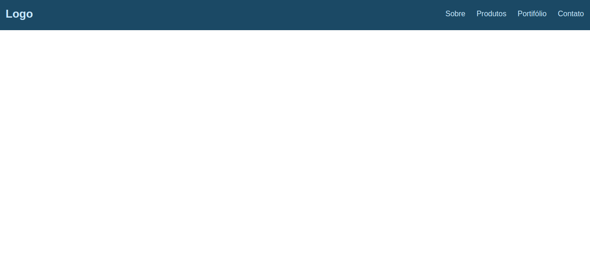
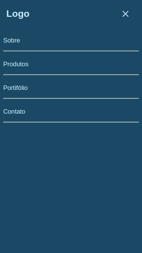

# Menu-hamburguer 🍔

## Sobre o projeto :information_source:

Um projeto que tem como objetivo criar um menu responsivo para um site que se adpta ao dispositivo.
Quando visualizado em telas maiores o menu se comporta como um layout de top bar.
Quando visualizado em telas menores o menu se comporta com um layout de side bar.

---

## Tecnologias :wrench:

As tecnologias usadas foram:

- HTML
- CSS
- JavaScript

---

## Preview 💻

Acesse a página: [**Menu de Hamburguer**](https://mateus-sousa23.github.io/menuHamburguer/)

  
  
 

